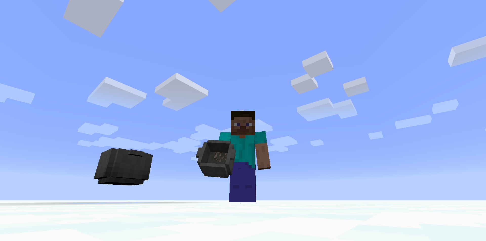
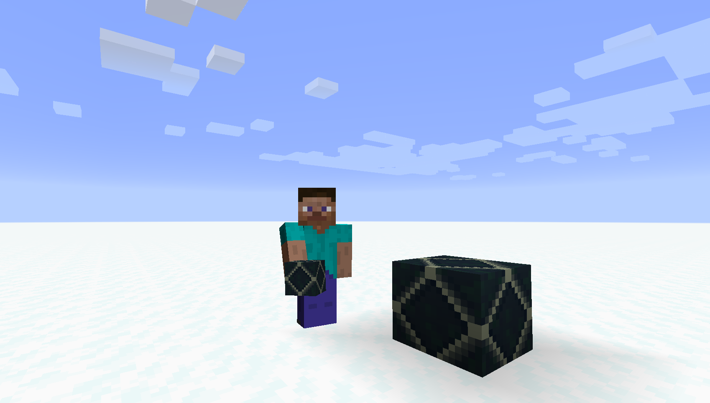

description: Создание собственного блока.

# Создание блока

## Основа

Создадим класс для нашего блока.

```java
public class IdealBlock extends Block
{
    public IdealBlock()
    {
        super(Properties.create(Material.ROCK).harvestTool(ToolType.PICKAXE));
    }

    @Override
    public List<ItemStack> getDrops(BlockState state, LootContext.Builder builder)
    {
        return ImmutableList.of(new ItemStack(Items.CAKE, 7), new ItemStack(Items.TORCH, 1));
    }
}
```

* `Material.ROCK` - задаёт материал блоку, т.е. материал будет влиять на ломание блока, звук хождения по нему, а так же на предметы которые могут ломать данный материал.
* `ToolType.PICKAXE` - задает тип эффективного инструмента.
* `getDrops` - возвращает все предметы которые должны выпасть с блока.

Также можно вынести Properties в конструктор.

## Регистрация

Создадим класс TutBlocks, пустой интерфейс INonItem.

```java
@Mod.EventBusSubscriber(modid = TestMod.MOD_ID, bus = Mod.EventBusSubscriber.Bus.MOD)
public class TutBlocks
{
    private static final DeferredRegister<Block> BLOCKS = new DeferredRegister<>(ForgeRegistries.BLOCKS, TestMod.MOD_ID);

    public static final RegistryObject<Block> IDEAL = BLOCKS.register("ideal",  IdealBlock::new);

    public static void register()
    {
        BLOCKS.register(FMLJavaModLoadingContext.get().getModEventBus());
    }
	
	@SubscribeEvent
    public static void onRegisterItems(final RegistryEvent.Register<Item> event)
    {
        final IForgeRegistry<Item> registry = event.getRegistry();
        PhoenixBlocks.BLOCKS.getEntries().stream()
                .map(RegistryObject::get)
                .filter(block -> !(block instanceof INonItem))
                .forEach(block -> {
                    final Item.Properties prop = new Item.Properties().group(Phoenix.PHOENIX);
                    final BlockItem blockItem = new BlockItem(block, prop);
                    blockItem.setRegistryName(block.getRegistryName());
                    registry.register(blockItem);
                });
    }
}
```

* `register(block)` - регестрирует блоки.
* `IDEAL` - обьект регистрации нашего блока. Чтоб получить сам блок нужно вызвать метод get().
* `onRegisterItems` - регестрирует предметы для блоков которые не наследуют INonItem.
* `INonItem` - пустой интерфейс для отмены регистрации предмета.

Нам нужно добавить в конструктор основоного класса TutBlocks.register() для регистрации блоков.
Теперь можете запустить Minecraft нажав на кнопку `run` и посмотреть свой блок в живую. Чтобы получить блок пропишите `/give @p tut:ideal`.
Вместо `tut` у Вас должен быть `modid` вашего мода! Вместо `ideal` у Вас должно быть регистрируемое имя вашего блока.

[](images/face_first.png)

[](images/face_three.png)

## Модель

Создадим файл `ideal.json`. По пути:
```md
└── src    
    └── main
        └── resources
            └── assets
                └── tut
                    └── blockstates
```
С содержанием:
```json
{
    "variants": {
        "": { "model": "tut:block/ideal" }
    }
}
```
В этом файле будет хранится информация о состояниях блоков. (Подробнее про состояние блоков, вы сможете прочитать в следующей статье)
Теперь Вы должны создать модель блока, Вы можете создать как наследника стандартного блока, примером может послужить камень, так и свою собственную. Вот пример стандартной модели:

```json
{
    "parent": "block/cube_all",
    "textures": {
        "all": "tut:blocks/ideal"
    }
}
```
Если ваша текстура к модели берётся из самого Minecraft, то `tut:`(modid) прописывать не надо! В примере с объёмной моделью я решил использовать текстуру камня из Minecraft.
Название файла должно быть таким же как и в `blockstates` -> `ideal`, в переменной `model`!


Теперь Вам надо создать `ideal.json`. По пути:
```md
└── src    
    └── main
        └── resources
            └── assets
                └── tut
                    └── models
                        └── item
```
```json
{
    "parent": "tut:block/ideal"
}
```

[](images/model_face_first.png)

[](images/model_face_three.png)

[](images/model_on_ground.png)
