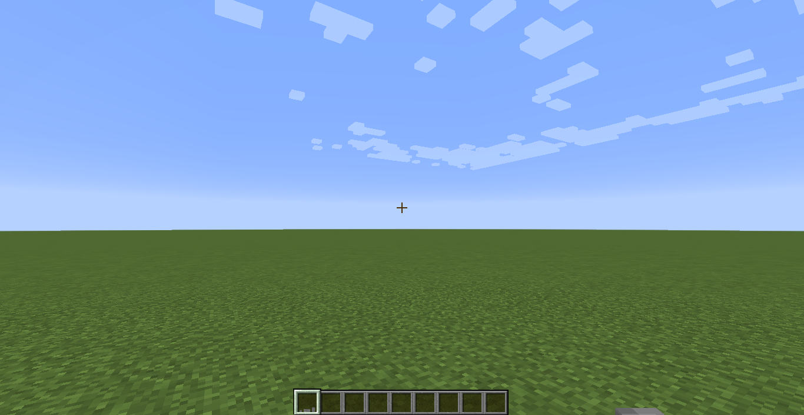

description: Создание собственного блока.

# Создание блока

## Основа

Создадим класс для нашего блока.

```java
public class IdealBlock extends Block
{
    public IdealBlock()
    {
        super(Properties.create(Material.ROCK).harvestTool(ToolType.PICKAXE));
    }

    @Override
    public List<ItemStack> getDrops(BlockState state, LootContext.Builder builder)
    {
        return ImmutableList.of(new ItemStack(Items.CAKE, 7), new ItemStack(Items.TORCH, 1));
    }
}
```

* `Material.ROCK` - задаёт материал блоку, т.е. материал будет влиять на ломание блока, звук хождения по нему, а так же на предметы которые могут ломать данный материал.
* `ToolType.PICKAXE` - задает тип эффективного инструмента.
* `getDrops` - возвращает все предметы которые должны выпасть с блока.
Также можно вынести Properties в конструктор.

## Регистрация

Создадим класс TutBlocks.

```java
public class TutBlocks
{
    private static final DeferredRegister<Block> BLOCKS = new DeferredRegister<>(ForgeRegistries.BLOCKS, TestMod.MOD_ID);

    public static final RegistryObject<Block> IDEAL = BLOCKS.register("updater",  IdealBlock::new);

    public static void register()
    {
        BLOCKS.register(FMLJavaModLoadingContext.get().getModEventBus());
    }
}
```

* `register(block)` - регестрирует блоки.
* `IDEAL` - обьект регистрации нашего блока. Чтоб получить сам блок нужно вызвать метод get(): IDEAL.get();

Нам нужно добавить 
Теперь можете запустить Minecraft нажав на кнопку `run` и посмотреть свой блок в живую. Чтобы получить блок пропишите `/give @p tut:best_stone`.
Вместо `tut` у Вас должен быть `modid` вашего мода! Вместо `best_stone` у Вас должно быть регистрируемое имя вашего блока.

[](images/face_first.png)

[](images/face_three.png)

## Модель

Для начала добавим такой код в BlocksRegister, в метод setRender
```java
Minecraft.getMinecraft().getRenderItem().getItemModelMesher().register(Item.getItemFromBlock(block), 0, new ModelResourceLocation(block.getRegistryName(), "inventory"));
```

Создадим файл `best_stone.json`. По пути:
```md
└── src    
    └── main
        └── resources
            └── assets
                └── tut
                    └── blockstates
```

```json
{
    "variants": {
        "normal": { "model": "tut:best_stone" }
    }
}
```

Теперь Вы должны создать тип рендера блока, Вы можете создать как стандартный тип рендера блока, примером может послужить камень, так и тип рендера в виде  модели. Вот пример стандартного типа рендера:

```json
{
    "parent": "block/cube_all",
    "textures": {
        "all": "tut:blocks/best_stone"
    }
}
```

Название файла должно быть таким же как и в `blockstates` -> `best_stone`, в переменной `model`!


Теперь Вам надо создать `best_stone.json`. По пути:
```md
└── src    
    └── main
        └── resources
            └── assets
                └── tut
                    └── models
                        └── item
```
Пример:
```json
{
    "parent": "tut:block/best_stone"
}
```

[Модель](https://yadi.sk/d/n9ehtKYk3LT9qv)

В этом файле будет хранится информация о состояниях блоков. (Подробнее про состояние блоков, вы сможете прочитать в следующей статье)

Если ваша текстура к модели берётся из самого Minecraft, то `tut:`(modid) прописывать не надо! В примере с объёмной моделью я решил использовать текстуру камня из Minecraft.

`tut` - modid нашего мода.
`best_stone` - регистрируемое имя нашего блока.

Когда ваша модель готово, добавьте её по пути:
```md
└── src    
    └── main
        └── resources
            └── assets
                └── tut
                    └── models
                        └── block
```

Добавим в ClientProxy, в метод init такой код  `BlocksRegister.registerRender();`.

И вот, что в конечном итоге у нас может получится.

[](images/model_face_first.png)

[](images/model_face_three.png)

[](images/model_on_ground.png)
