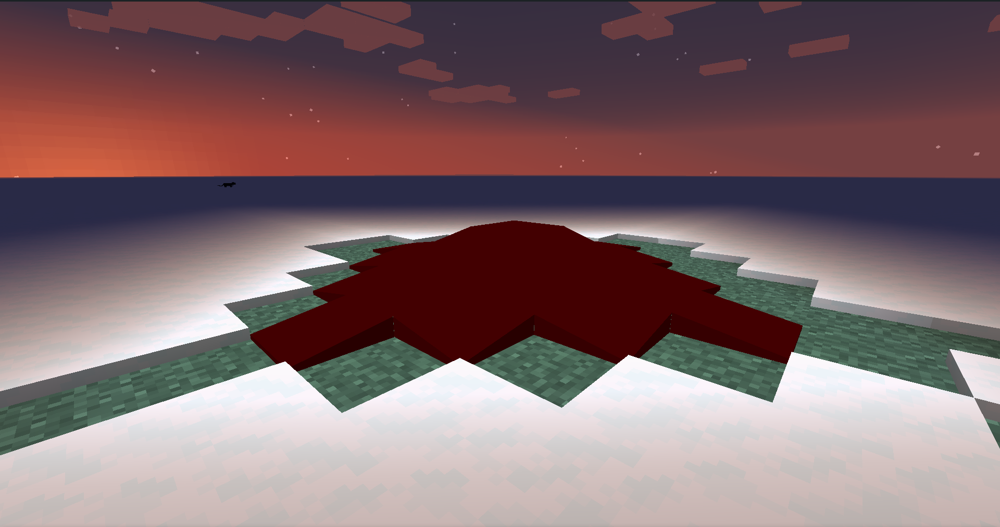
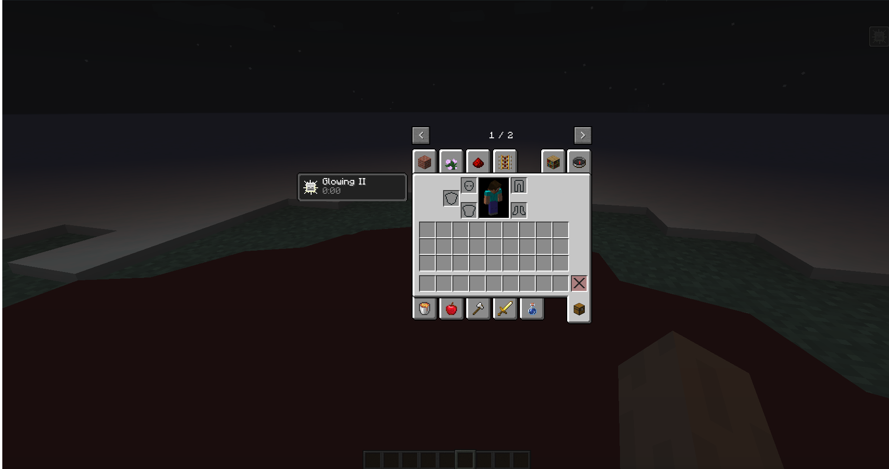

description: Создание собственной жидкости.

# Создание жидкости

## Основа

Создадим блок для нашей жидкости.

```java
public class OilBlock extends FlowingFluidBlock implements INonTab {
    public OilBlock() {
        super(() -> TutFluids.OIL_SOURCE, Block.Properties.create(Material.WATER)
                .doesNotBlockMovement()
                .lightValue(15)
                .hardnessAndResistance(100.0F)
                .noDrops());
    }
}
```
Теперь нам нужен класс для нашей жидкости:
```java
public abstract class OilFluid extends ForgeFlowingFluid {
    protected OilFluid(Properties properties) {
        super(properties);
    }

    public static FluidAttributes.Builder makeAttributes() {
        ResourceLocation still   = new ResourceLocation(TutMod.MOD_ID, "fluid/oil_still");
        ResourceLocation flowing = new ResourceLocation(TutMod.MOD_ID, "fluid/oil_flow");
        return FluidAttributes.builder(still, flowing).rarity(Rarity.EPIC)
                .density(3000)
                .viscosity(1200)
                .color(0x72727272)
                .luminosity(2);
    }

    @Override
    protected int getLevelDecreasePerBlock(IWorldReader worldIn) {
        return 2;
    }

    public static class Flowing extends OilFluid {
        public Flowing() {
            super(new Properties(TutFluids.OIL_SOURCE::get, TutFluids.OIL_FLOWING::get, makeAttributes())
                    .block(TutBlocks.OIL)
                    .bucket(TutItems.BUCKET_OIL));
            setDefaultState(getStateContainer().getBaseState().with(LEVEL_1_8, 7));
        }

        @Override
        protected void fillStateContainer(StateContainer.Builder<Fluid, IFluidState> builder) {
            super.fillStateContainer(builder);
            builder.add(LEVEL_1_8);
        }

        @Override
        public int getLevel(IFluidState state) {
            return state.get(LEVEL_1_8);
        }
        
        @Override
        public boolean isSource(IFluidState state) {
            return false;
        }
    }

    public static class Source extends OilFluid {
        public Source() {
            super(new Properties(TutFluids.OIL_SOURCE::get, TutFluids.OIL_FLOWING::get, makeAttributes())
                    .block(TutBlocks.OIL)
                    .bucket(TutItems.BUCKET_OIL));
        }

        public int getLevel(IFluidState state) {
            return 8;
        }
        
        public boolean isSource(IFluidState state) {
            return true;
        }
    }
}
```
И так разберем:
* `OilFluid` - Абстрактный класс нашей жидкости. Для удобства создание атрибутов я перенесла в отдельный метод.
    * `still и flowing` - это текстуры жидкости в стоячем и текущем положении соответственно.
    * `density` - это плотность. Отвечает за скорость плавания.
    * `viscosity` - это вязкость отвечает за скорость растекания жидкости
    * `color` - это цвет. Нужен для определения цвета дымки. По умолчанию белый.
    * `luminosity` - это яркость свечения. По умолчанию 0.
* `getLevelDecreasePerBlock` - это понижение уровня жидкости каждый блок. По умолчанию 1;
* `Flowing` - Класс текущей жидкости.
* `Source`  - Класс жидкости источника.

Увы в новой версии нет форджевского ведра которое любезно будет хранить вашу жидкость. Его надо создать:
```java
public class OilBucketItem extends BucketItem {
    public OilBucketItem() {
        super(TutFluids.OIL_SOURCE::get, new Item.Properties()
                .containerItem(Items.BUCKET)
                .maxStackSize(1)
                .group(ItemGroup.MATERIALS));
    }

    @Override
    public ICapabilityProvider initCapabilities(@Nonnull ItemStack stack, @Nullable CompoundNBT nbt) {
        return new FluidBucketWrapper(stack);
    }
}
```
## Регистрация

Регистрация блока и ведра никак не отличается от стандартной поэтому разбеорем только саму жидкость.
Создадим класс TutFluids.

```java
public class TutFluids {
    private static final DeferredRegister<Fluid> FLUIDS = new DeferredRegister<>(ForgeRegistries.FLUIDS, TutMod.MOD_ID);

    public static final RegistryObject<FlowingFluid> OIL_SOURCE = FLUIDS.register("ideal", OilFluid.Source::new);
    public static final RegistryObject<FlowingFluid> OIL_FLOWING = FLUIDS.register("oil", OilFluid.Flowing::new);

    public static void register() {
        FLUIDS.register(FMLJavaModLoadingContext.get().getModEventBus());
    }
}
```

Нам нужно добавить в конструктор основного класса TutFluids.register(). 

[](images/fluid.png)

## Эффект при соприкосновении

Давайте у нас будет жидкость волшебная и будет заставлять светиться каждого, кто к ней прикоснется. Для этого в блоке нашей жидкости предопределим метод onEntityCollision.

```java
    @Override
    public void onEntityCollision(BlockState state, World worldIn, BlockPos pos, Entity entityIn){
        if (!worldIn.isRemote && entityIn instanceof LivingEntity) {
            LivingEntity entity = (LivingEntity) entityIn;
            entity.addPotionEffect(new EffectInstance(Effects.GLOWING, 1, 1));
        }
    }
```

[](images/glowing.png)
