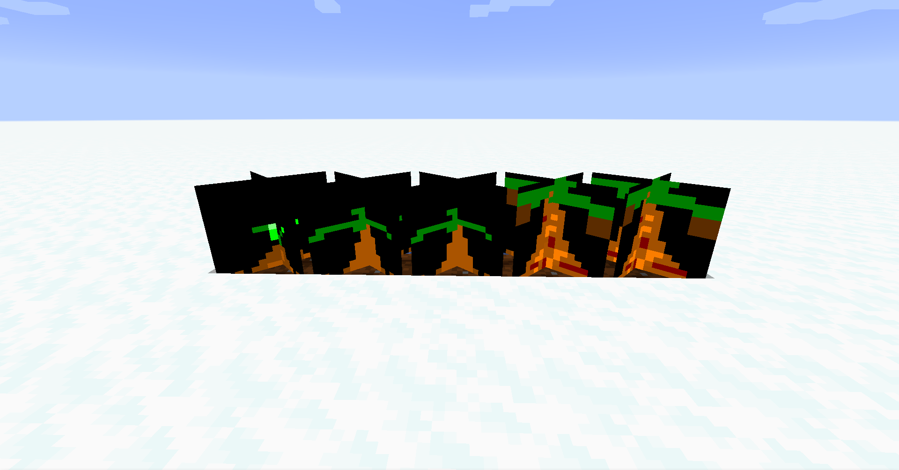
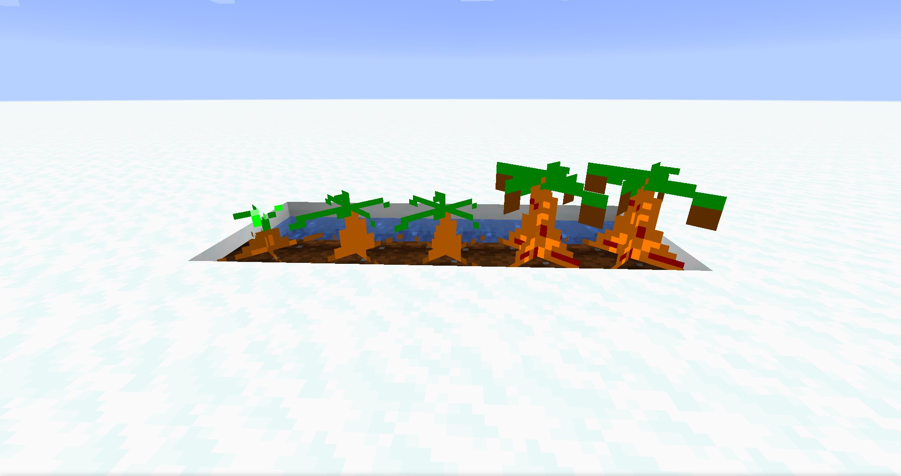

description: Статья о создании собственных агрокультур.

# Агрокультуры
У нас уже есть кокос, но нету пальмы. Давайте это исправим(у нас будет маленько карликавая пальма).

## Блок агрокультуры

Давайте создадим класс под названием `PalmeBlock`, который будет унаследован от `CropsBlock`, где предопределим getSeedsItem, getShape, getDrops и getMaxAge.
```java
public class PalmBlock extends CropsBlock implements INonItem
{
    public PalmBlock()
    {
        super(Block.Properties.create(Material.PLANTS).doesNotBlockMovement().tickRandomly().hardnessAndResistance(0, 0).sound(SoundType.CROP));
    }

    @Nonnull
    @Override
    protected IItemProvider getSeedsItem()
    {
        return TutItems.COCOUNT.get();
    }

    @Override
    public int getMaxAge()
    {
        return 4;
    }

    @Nonnull
    @Override
    public VoxelShape getShape(BlockState state, @Nonnull IBlockReader worldIn, @Nonnull BlockPos pos, @Nonnull ISelectionContext context)
    {
        switch(state.get(this.getAgeProperty()))
        {
            case 0:
                return Block.makeCuboidShape(0.0D, 0.0D, 0.0D, 16.0D, 2.0D, 16.0D);
            case 1:
                return Block.makeCuboidShape(0.0D, 0.0D, 0.0D, 16.0D, 4.0D, 16.0D);
            case 2:
                return Block.makeCuboidShape(0.0D, 0.0D, 0.0D, 16.0D, 8.0D, 16.0D);
            default:
                return Block.makeCuboidShape(0.0D, 0.0D, 0.0D, 16.0D, 12.0D, 16.0D);
        }
    }

    @Nonnull
    @Override
    public List<ItemStack> getDrops(@Nonnull BlockState state, LootContext.Builder builder)
    {
        return isMaxAge(state) ? ImmutableList.of(new ItemStack(TutItems.COCOUNT.get(), 1 + builder.getWorld().rand.nextInt(4))) :
                ImmutableList.of(new ItemStack(TutItems.COCOUNT.get(), 1), new ItemStack(Items.STICK, state.get(this.getAgeProperty())));
    }
}
```

Разберем:
 *  Предмета не регистрируется.
 * `getSeedsItem` Возвращает семя, из которого вырастает наша пальма.
 * `getMaxAge` Возвращает максимальный возраст растения.
 * `getShape` Возврщает коллизию растения в зависимости от стадии роста.
 * `getDrops` Возвращает дроп. Если выросло, то выпадает от 1 до 5 кокосов, если нет, то 1 кокос и столько палок, сколько стадий роста прошло.

Теперь стандартная регистрация блока. Но есть проблема. Мы все еще не можем посадить кокос. Для того чтоб это исправить нам надо сменить родителя кокоса на BlockNamedItem и передать по параметру наш блок пальмы:
```java
public class CoconutItem extends BlockNamedItem
{
    public CoconutItem()
    {
        super(TutBlocks.PALM.get(), new Properties()
                .group(TutMod.TUT_GROUP)
                .food(
                        new Food.Builder()
                                .hunger(5)
                                .saturation(5).
                                setAlwaysEdible()
                                .fastToEat()
                 .effect(() -> new EffectInstance(Effects.GLOWING, 10, 100), 10)
                 .build()));
    }
}
```
Все теперь сажается и даже ростет! Но ростим мы квадратики. Давайте ростить пальму! 

## Моделька для нашей агрокультуры
Увы в 1.15 убрали forge формат блокстейтов, поэтому используем обычный.
Теперь нужно создать файл блокстейта для нашей пальмы. Создадим json файл `palm` в папке с блок стейтами. Наследоваться будем от `cross` чтоб плучить красивую модельку крестиком.

```json
{
  "variants": 
  {
    "age=0": { "model": "tut:block/palm/stage_0" },
    "age=1": { "model": "tut:block/palm/stage_1" },
    "age=2": { "model": "tut:block/palm/stage_2" },
    "age=3": { "model": "tut:block/palm/stage_3" },
    "age=4": { "model": "tut:block/palm/stage_4" }
  }
}
```
Блок `variants` используется для определения текстур, которые должен использовать блок в разный ситуациях. В нашем случае это изменение "age". Подробнее в статье про состояния блоков.
```json
{
  "parent": "block/cross",
  "textures": {  "cross": "tut:blocks/palm_0" }
}

```
```json
{
  "parent": "block/cross",
  "textures": {  "cross": "tut:blocks/palm_1" }
}

```
```json
{
  "parent": "block/cross",
  "textures": {  "cross": "tut:blocks/palm_2" }
}
```
```json
{
  "parent": "block/cross",
  "textures": { "cross": "tut:blocks/palm_3" }
}

```
```json
{
  "parent": "block/cross",
  "textures": {  "cross": "tut:blocks/palm_4" }
}
```
Теперь нужно добавить текстуры. В соответствии с блокстейтом их должно быть 5,  разместим их по пути "src/main/resources/assets/tut/textures/blocks/palm/". 
Результат:
[](images/wrong.png)
Для того чтоб исправить это, нужно вызвать `RenderTypeLookup::setRenderLayer` в FMLClientSetupEvent
```java
    @SubscribeEvent
    public static void init(FMLClientSetupEvent event)
    {
         RenderTypeLookup.setRenderLayer(TutBlocks.PALM.get(), RenderType.getCutout());
    }
```

[](images/demonstration.png)
