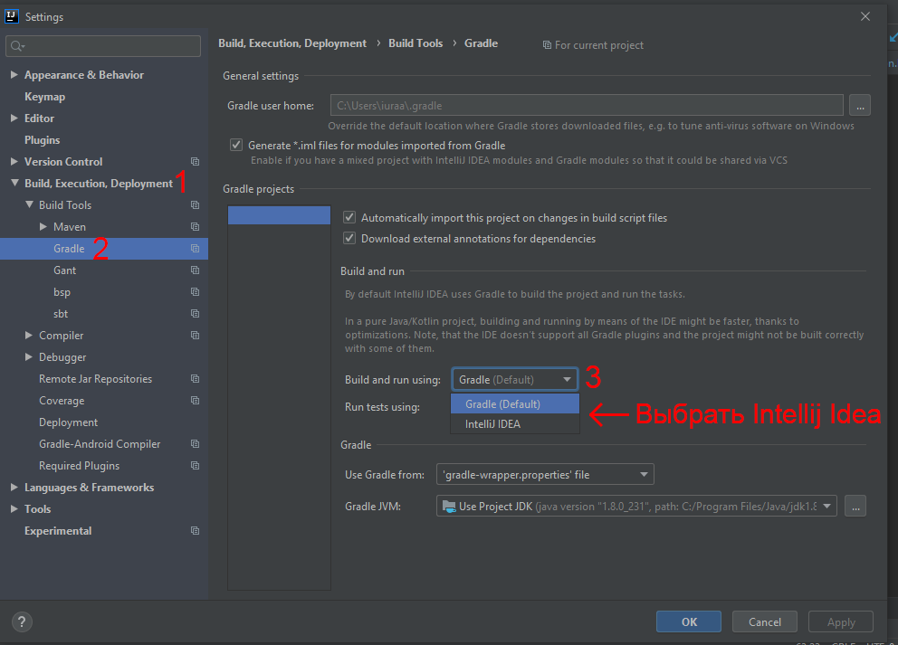
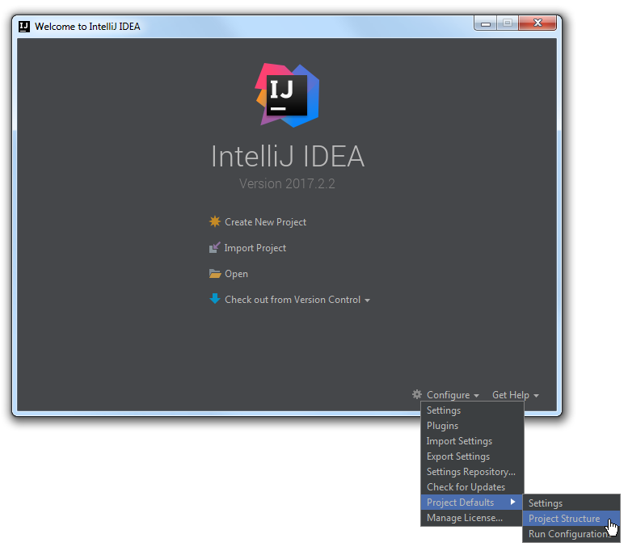
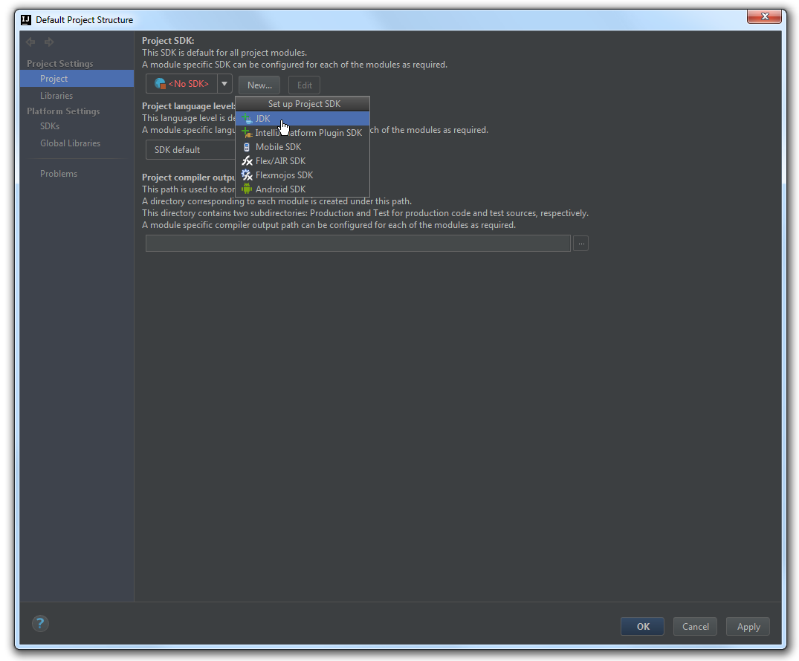
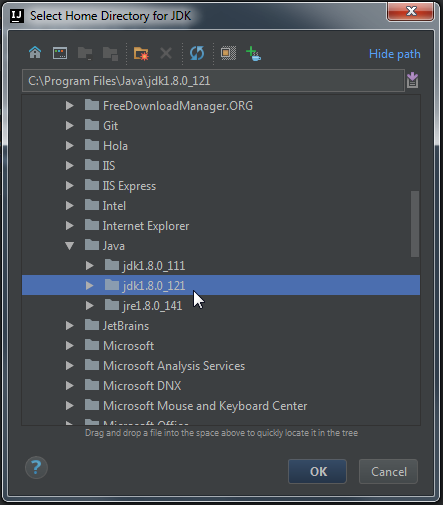

description: Разбор и решение проблем, возникающих в процессе настройки среды разработки Minecraft модов.

# Решение проблем

В этой статье разбираются самые распростаненные ошибки, а также способы их решения.

## Идея не грузит ресурсы(текстуры, модели и т.д)

Иногда Intellij не подгружает ресурсы мода. Есть панацея в виде такой строчки в build.gradle:
idea.module.inheritOutputDirs = true
И оно отлично решает проблему. Но, как оказалось, не всегда и не у всех. После обновления от 19 года, идея стала использовать сборку граблей, а именно "раскидывание" ресурсов и классов по разным папкам. Ранее данная "фича" не была введена и всё забрасывалось идеей в одну папку. Чтобы исправить это, надо лишь изменить сборку и запуск с Gradle на IDEA:

Ну и всё, далее ресурсы мода будут грузиться как и раньше.

Фикс позаимствован из статьи авторства [tox1cozZ](https://forum.mcmodding.ru/members/tox1cozz.3744/).

## Ошибка "Use JAVA_HOME (not defined yet)"

Эта ошибка появляется, когда среда не может найти установленный JDK.

Решается проблема элементарно. Для начала, закройте окно импорта и вернитесь к стартовому окну IntelliJ и в правом нижнем
углу нажмите на кнопку "Configure", откройте вкладку "Project Defaults" и выберите пункт "Project Structure".

[{: .w8 }](images/setup_gradle_1.png)

В открывшемся окне нажмите на кнопку "New...", которая находится рядом с красной надписью "No SDK" и выберите пункт JDK.

[{: .w9 }](images/setup_gradle_2.png)

Теперь просто укажите путь к установленной JDK. В моем случае путь следующий `C:\Program Files\Java\jdk1.8.0_121`.

