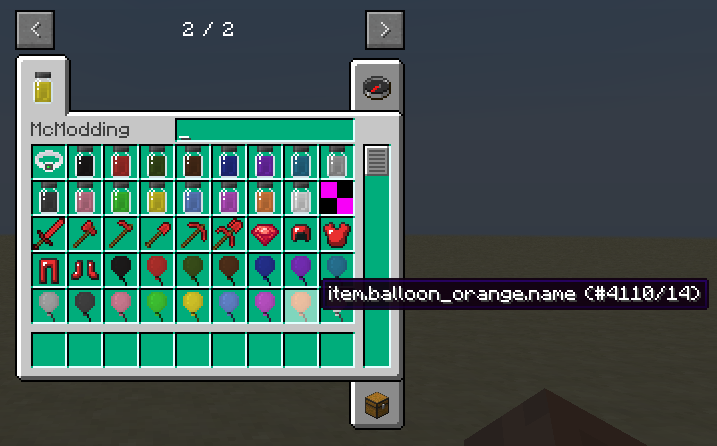

description: Подтипы для предметов

# Добавление подтипов предмету

Ближе к концу раздела у вас уже набралось огромное количество предметов, но что будет если мы захотим добавить
предметы разного цвета и с разными названиями или с разными свойствами? Для это существует возможность создавать подтипы
по средствам переменной `ItemStack.damage`.

`ItemStack.damage` ограничен 32.767, а следовательно, мы можем создать 32.767 вариаций нашего предмета. Но как `damage`
нам сможет помочь? На самом деле, данная переменная является "универсальной", так как используется для прочности инструментов
и может использоваться для указания подтипов.

!!! danger "Внимание!"
    Не используйте подтипы для инструментов или предметов, которые можно сломать, так как это может привести к дюпу.

Создадим класс шарика:

```java
public class BalloonItem extends Item {
    public BalloonItem() {
        setHasSubtypes(true);// Указывает, что предмет содержит подтипы
    }

    /**
     * Возвращает нелокализованное название предмета.
     *
     * @param stack Стэк содержащий предмет класса BalloonItem
     * @return Возвращает нелокализованное название предмета формата: item.*unlocalizedName*
     */
    @Override
    public String getUnlocalizedName(ItemStack stack) {
        // Добавим суффикс, чтобы к item.balloon было дописано название цвета: item.balloon_*colorName* в зависимости от типа
        return super.getUnlocalizedName(stack) + '_' + ItemDye.field_150921_b[stack.getItemDamage() % ItemDye.field_150921_b.length];
    }

    /**
     * Возвращает цвет предмета. Стандартный цвет предмета: 0xFFFFFF(16777215).
     *
     * @param stack      Стэк содержащий предмет класса BalloonItem
     * @param renderPass Текущий проход отрисовки
     * @return Цвет. Стандартный цвет: 0xFFFFFF(16777215).
     */
    @Override
    public int getColorFromItemStack(ItemStack stack, int renderPass) {
        // Изменим цвет нашего предмета в зависимости от его типа
        return ItemDye.field_150922_c[stack.getItemDamage() % ItemDye.field_150922_c.length];
    }

    /**
     * Данный метод заполняет список творческой вкладки новыми стэками, содержащие информация о предмете.
     *
     * @param item  Текущий предмет(в нашем случае объект класса BalloonItem)
     * @param tab   Творческая вкладка(сломано! Принимает только собственную вкладку в которой находится)
     * @param items Список стэков открытой вкладки
     */
    @Override
    @SideOnly(Side.CLIENT)
    @SuppressWarnings("unchecked")
    public void getSubItems(Item item, CreativeTabs tab, List items) {
        for (int damage = 0, size = ItemDye.field_150922_c.length; damage < size; damage++) {
            items.add(new ItemStack(item, 1, damage));
        }
    }
}
```

!!! info "ItemStack"
    Первым параметром в `ItemStack` выступает класс `Item` или `Block`(см. статью "Создание блока"),
    вторым параметром идёт количество предметов в стэке, максимум может быть 64 предмета(в зависимости от предмета
    это кол-во может меняться: 1 - лодка, 16 - снежки, 64 - камень и др.) Третий параметр это damage.
    Стандартное значение последних двух параметров: размер - 1, damage - 0.
    Мы будем использовать стандартные значения, поэтому достаточно в `ItemStack` передать только предмет.

Для подтипов вы можете также инициализировать стэки, чтобы получить их готовыми в творческой вкладке. К примеру,
вы добавили свою энергию и вы хотите, чтобы ваш предмет был заряжен сразу во вкладке, то вы можете сделать так:

```java
public class BalloonItem extends Item {
    public void getSubItems(Item item, CreativeTabs tab, List items) {
        final ItemStack balloonStack = new ItemStack(item);
        EnergManager.fillStack(balloonStack, 10_000);
        items.add(balloonStack);
    }
}
```

Добавим текстуру:


Зарегистрируем один раз предмет и запустим игру, чтобы посмотреть, что у нас получилось:

