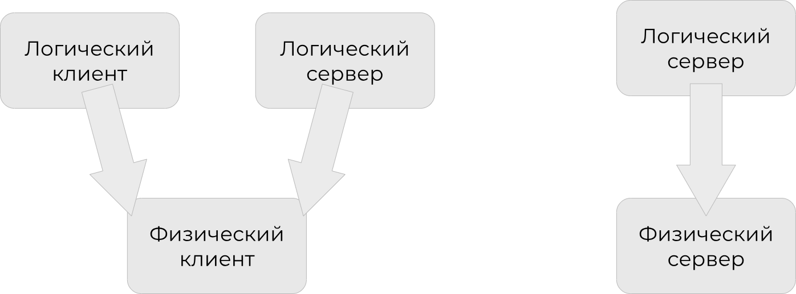

# Разделение на клиент и сервер
Minecraft использует клиент-серверную модель. Это значит, что мы можем загрузить клиент и подключиться к серверу для игры. Fabric даёт возможность создавать моды только для сервера, клиента или же сразу клиент-серверные моды.

Концепция клиента и сервера в Minecraft очень неоднозначна и может относиться либо к физической, либо к логической стороне. Термины "клиент" и "сервер" могут использоваться для различения дистрибутивов игры (клиент и выделенный сервер), которые называются "физическими" сторонами. Однако клиент содержит свой собственный интегрированный сервер для одиночной игры или игры по локальной сети. Это значит, что клиент также содержит логику сервера. Следовательно, клиент/сервер также может использоваться для различения частей игровой логики, которые зовутся "логическими" сторонами.

Для обоих типов сторон есть "клиент" и "сервер". Однако логический клиент не то же самое что и физический, а физический сервер не равен логическому серверу. Вместо этого логический клиент размещается на физическом клиенте, а логический сервер размещается на физическом сервере или физическом клиенте.

Понимание логических сторон важно для разработки модов, так как эти стороны занимают центральное место в архитектуре игры.

## Физические стороны
Физические стороны (или среды, т.е. `environments`) представляют собой физический клиент (игра, которую мы можем запустить из лаунчера) и физический сервер (доступный для загрузки на официальном сайте игры), проще говоря - это jar-файлы (дистрибутивы).

Клиентская и серверная среда являются минимизированным дистрибутивом одной и той же программы, но содержащая только необходимый код. Так например, сервер не будет иметь классов для рендера.

В Fabric Вы часто можете видеть аннотации, такие как `@Environment(EnvType.CLIENT)`. Это указывает на то, что некоторый код присутствует только в одной среде (здесь используется обозначение клиентской части).

`fabric.mod.json` и файл Mixins тоже содержат разделение на клиент-серверные части. Каждая физическая сторона использует свои точки входа.

## Логические стороны
За логику игры отвечают логические стороны. Логический клиент отправляет состояние игрока, выполняет рендер, частично моделирует мир. Логический сервер обрабатывает основную логику (например, рост растений, AI мобов и т.п.), обрабатывает пакеты и поддерживает состояние игрового мира.

Клиент поддерживает частичную копию мира сервера с копиями таких объектов, как:

`net.minecraft.world.World`
`net.minecraft.entity.Entity`
`net.minecraft.block.entity.BlockEntity`

Эти реплицированные объекты позволяют клиенту и серверу выполнять некоторую общую игровую логику. Клиент может взаимодействовать с этими объектами, в то время как сервер выполнять синхронизацию. Вы нередко можете встретить проверку типа `if (!world.isClient)`, это необходимо для отличия объектов на логическом клиенте от объектов на логическом сервере, чтобы избежать рассинхронизации.

## Глубокое погружение в стороны игры
Понимая, какие стороны существуют и чем они отличаются, мы можем рассмотреть их подробнее.

### Физический клиент
**Физический клиент** - это jar-файл игры, загружаемый лаунчером для запуска. Он содержит логический клиент и логический (интегрированный) сервер (см. схему выше). Его точка входа - `net.minecraft.client.main.Main`.

Физический клиент может загружать несколько разных миров, каждый на отдельном логическом сервере, но только по одному за раз.

По сравнению с логическим сервером в физическом сервере, логический сервер клиента способен управляться этим самым логическим клиентом на физическом клиенте.

Весь логический клиентский контент является эксклюзивным для физического клиента, поэтому Вы видите множество аннотаций среды для рендеринга, звука и другого логического клиентского кода.

Некоторые моды нацелены только на клиент, например, Optifine, Liteloader или Sodium.

### Физический сервер
**Физический сервер** - это выделенный Java сервер. По сравнению с физическим клиентом, у него есть только логический сервер. Его точкой входа является `net.minecraft.server.MinecraftServer`, и еще он может иметь только один мир во время его выполнения. Если сервер должен переключиться в другой мир, потребуется его перезапуск.

Логический сервер физического клиента немного отличается от логического сервера физического клиента, поскольку при работе физического сервера всегда присутствует один экземпляр логического сервера. Более того, логическим сервером физического сервера можно управлять удалённо через RCON, а так же он имеет файл `server.properties` для конфигурации и может отправлять серверные пакеты ресурсов.

Несмотря на эти различия, большинство модов применимы к логическим серверам как физического клиента, так и физического сервера, если они не относятся к логическому клиентскому содержимому.

### Логический клиент
**Логический клиент** - это интерфейс для игрока. Рендеринг (LWJGL), пакеты ресурсов, обработка ввода и звуки происходят на логическом клиенте. Его нет на физическом сервере.

### Логический сервер
**Логический сервер** - это место, где выполняется большая часть игровой логики. Пакеты данных, обновления мира, тики сущностей и тиков блоков, ИИ мобов, сохранение игры и мира, а также генерация происходят на логическом сервере.

Логический сервер на физическом клиенте называется "интегрированным сервером", а логический сервер на физическом сервере называется "выделенным сервером" (это также название самого физического сервера).

Логический сервер работает в своём собственном потоке. Срок жизни сервера зависит от физической стороны, на которой он размещён. Так, на физическом клиенте логический сервер будет работать пока игрок находится в мире, но на физическом сервере логический сервер будет работать пока работает физический сервер.

## Передача данных
Единственно верным путём общения для сторон будут пакеты данных. Пакеты отправляются между логическим сервером и логическим клиентом, а не физическими сторонами. Модификации могут добавлять свои пакеты если будет такая необходимость. Обмен пакетами осуществляется в памяти для логического клиента, подключенного к его собственному интегрированному серверу, а в противном случае - по сетевому протоколу.

Логические клиенты отправляют пакеты C2S (Client-To-Server) на логический сервер. Логический сервер отправляет пакеты S2C (Server-To-Client) логическим клиентам. Пакеты отправляются методом записи в сетевом потоке и принимаются вызовом метода чтения в сетевом потоке.
