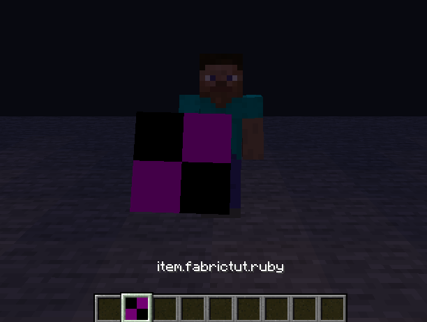
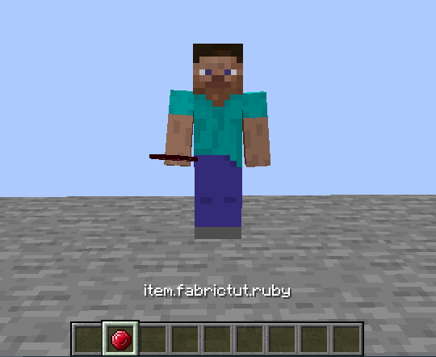

# Создание предмета

## Основа
Создадим где-нибудь пакет `item`, в котором у нас будут наши предметы. Вы заметили, что мы создаем пакет каждый раз для каждого типа класса?
Это нужно чтобы не захламлять основной пакет мода и для лучшей навигации по директориям.

Итак, создадим класс для нашего предмета:
```java
package ru.mcmodding.fabrictut.item;

import net.minecraft.item.Item;
import net.minecraft.item.ItemGroup;

public class RubyItem extends Item {
    public RubyItem(Settings settings) {
        super(settings);
        settings.group(ItemGroup.MATERIALS);
    }
}
```
`settings.group(ItemGroup.MATERIALS);` поместит наш предмет во вкладку "Материалы" в инвентаре креатива. Вообще, эта строка не обязательна, но зато нам не придется выдаывать себе предмет командой.

## Регистрация
Создаем в том же пакете класс где будут объявлены наши предметы, я назову его `FTutItems`.

В прошлом разделе мы создали класс для работы с реестром, который сейчас нам пригодится:
```java
package ru.mcmodding.fabrictut.item;

import net.fabricmc.fabric.api.item.v1.FabricItemSettings;
import net.minecraft.item.Item;
import ru.mcmodding.fabrictut.util.FabricTutRegistry;

public class FTutItems {
    public static final Item RUBY_ITEM = FabricTutRegistry.registerItem("ruby", new RubyItem(new FabricItemSettings()));
    
    public static void init() {} // зачем это нужно я объясню позже
}
```
Для того чтобы не писать каждый раз длинное название класса `FabricTutRegistry`, мы можем просто импортировать нужные методы статично:
```java
package ru.mcmodding.fabrictut.item;

import net.fabricmc.fabric.api.item.v1.FabricItemSettings;
import net.minecraft.item.Item;
import static ru.mcmodding.fabrictut.util.FabricTutRegistry.registerItem; // импортировали только метод

public class FTutItems {
    public static final Item RUBY_ITEM = registerItem("ruby", new RubyItem(new FabricItemSettings()));

    public static void init() {} // зачем это нужно я объясню позже
}
```
Если мы запустим игру, наш предмет все еще не появится. Именно поэтому нам нужен метод `init()`, несмотря на то, что он пустой.
Мы просто вызываем этот пустой метод в нашем главном классе, в методе `onInitialize()`:
```java
public class FabricTutorial implements ModInitializer {
    public static final String MOD_ID = "fabrictut";
    @Override
    public void onInitialize() {
        FTutItems.init();
    }
}
```
Опытные Java разработчики могут сказать что это костыль, возможно это и так, но они должны понимать для чего это было сделано.

Запускаем игру:


## Модель и текстура
Создаем в папке с ресурсами еще одну директорию: `assets/<mod_id>`, где `<mod_id>` - ID мода. В ней хранятся такие ресурсы как модели, текстуры, файлы локализации и прочее.

Создаем файл `ruby.json` по пути `assets/<mod_id>/models/item` с таким содержимым:
```json
{
  "parent": "minecraft:item/generated",
  "textures": {
    "layer0": "fabrictut:item/ruby"
  }
}
```
`fabrictut` - ID мода, `ruby` - ID предмета.

В `assets/<mod_id>/textures/item` кладём нашу текстуру предмета. Я достал текстуру рубина из самой игры, Вы можете взять любую другую текстуру.

**Важно**: название файла текстуры и модели должно соответсвовать ID предмета! Т.е. для предмета с ID `ruby` модель и текстура будут называться `ruby.json` и `ruby.png` соответственно.

Запустим игру и проверим, что получилось.


## Еще немного о регистрации
На самом деле, не обязательно создавать каждому предмету новый класс. Если у Вас есть несколько однотипных предметов (например, слитков), Вы можете просто объявить их в классе с предметами, т.е.
```java
public static final Item COPPER_INGOT = registerItem("copper_ingot", new Item(new FabricItemSettings()));
public static final Item ALUMINIUM_INGOT = registerItem("aluminium_ingot", new Item(new FabricItemSettings()));
```
Как мы видим, предметы имеют абсолютно одинаковый класс и отличаются лишь своими ID и названиями переменных.
